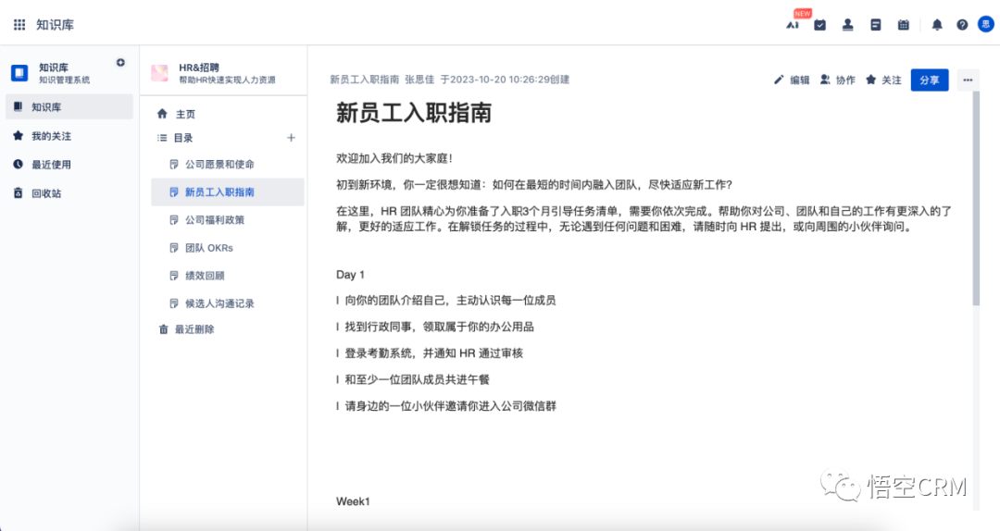
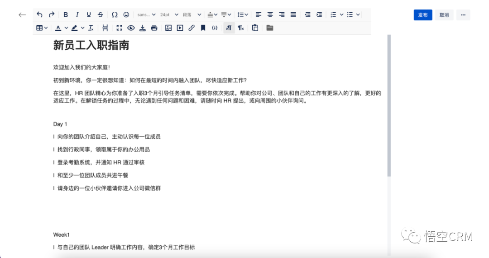
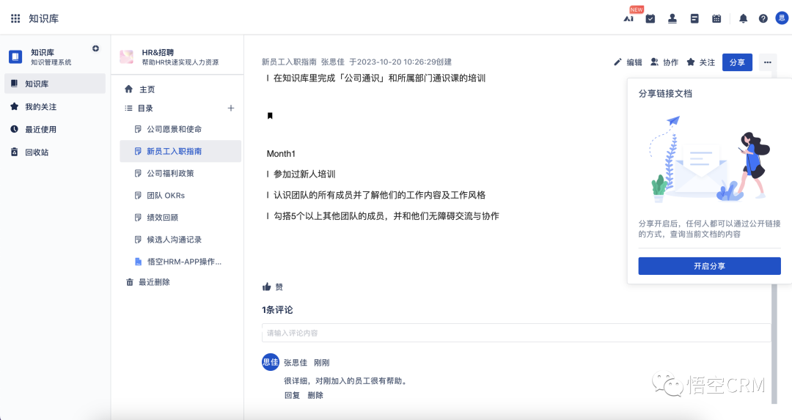

# Wukong_KnowledgeBase
体验地址：[https://www.72crm.com](http://www.72crm.com)

## 悟空知识库管理介绍


悟空知识库管理系统正式开源，从知识库管理的角度出发，用集中的数据将几乎所有与知识库相关的信息。您可以通过悟空CRM知识库创建页面，除了采用空白文档，也可以选择模板。模板是在空白文档的基础上，根据特定需求添加了一些文档要素，可辅助用户更好更快地创建文档。


悟空知识库内置了大量的模板，可辅助用于项目工作的各个环节，包括产品需求、会议记录、决策记录、指导手册（How-to）、回顾记录、工作计划、任务报告等等。通过知识库可以创作您的wiki。进行团队协同创作。


官网地址：[http://www.5kcrm.com](http://www.5kcrm.com/)


扫码添加小悟官方客服微信，邀您加入千人微信交流群：


关注悟空CRM公众号，了解更多悟空资讯


扫码加入微信群，在线客服解答疑问


:boom:  :boom:  :boom: 注：悟空知识库管理系统采用全新的前后端分离模式，本仓库代码中已集成前端vue打包后文件，  **可免去打包操作，无需运行前端**


# 悟空知识库目录结构

``` lua
wk_open_km
├── common        -- 基础模块
├── DB        -- sql文件
├── km        -- 知识库管理模块
├── ux        -- 前端源码
```

# 核心功能模块

**知识库创作，支持多种模板知识库创作** <br/>
**在线编辑，支持文档在线编辑** <br/>
**知识库评论，支持对文章进行评论** <br/>
**知识分享，支持生成外部链接，进行分享** <br/>
**全局检索，支持内容检索** <br/>


# 悟空知识库管理使用的主要技术栈

# 后端：

|名称                 | 版本                     | 说明   |
|---------------------|---------------------------|----  |
| spring-cloud-alibaba| 2021.0.5.0                 |  核心框架  |
| spring-boot         | 2.7.15                    |  spring版本  |
| mybatis-plus        | 3.5.3.2                    |  ORM框架  |

# 前端：

| 技术 | 说明 | 版本 |
| --- | --- | --- |
| [Vue](https://vuejs.org) | 框架 | 2.5.17 |
| [Vue-router](https://router.vuejs.org) | 路由框架 | 3.0.1 |
| [Vuex](https://vuex.vuejs.org) | 全局状态管理框架 | 3.0.1 |
| [Element](https://element.eleme.io) | UI框架 | 2.12.0 |
| [Axios](https://github.com/axios/axios) | HTTP框架 | 0.18.0 |

# 使用说明

### 一、前置环境
- Jdk1.8
- Maven3.5^
- Mysql8^
- Redis(版本不限)
- elasticsearch8.5.3

### 安装说明

#### 一、依赖环境安装

###### 1. 安装jdk
```
yum -y install java-1.8.0-openjdk-devel;
```

###### 2. 安装redis
```
yum -y install epel-release;
yum -y install redis;
chkconfig redis on;
#-- 修改redis密码为123456
yum -y install vim;
vim /etc/redis.conf;
#-- 在文件最下面追加一行
requirepass 123456
#-- 或者输入 / 搜索 # requirepass foobared
#-- 将前面的#删除，将foobared改为123456
#-- 修改完成之后 :wq 保存并退出,重启redis
service redis restart;
```

###### 3.安装mysql
```
wget https://repo.mysql.com//mysql80-community-release-el7-3.noarch.rpm
yum -y install mysql80-community-release-el7-3.noarch.rpm
yum -y install mysql-community-server --nogpgcheck
sudo systemctl start mysqld.service;
sudo systemctl enable mysqld.service;

--查看安装的mysql默认密码
grep "password" /var/log/mysqld.log
--进入mysql 例：mysql -u root -p"GXOO%eiI/7o>"
mysql - u root -p"此处为上一步的默认密码" 
 
--修改mysql密码，如下图所示
set global validate_password_policy=LOW;
ALTER USER 'root'@'localhost' IDENTIFIED BY 'password';

--退出mysql
exit
    
--修改mysql配置
vim /etc/my.cnf;
--输入 i 进入编辑模式，修改sql_mode设置，将下面sql_mode配置复制，到 [mysqld]下使用 shift+insert 粘贴
sql_mode=STRICT_TRANS_TABLES,NO_ZERO_IN_DATE,NO_ZERO_DATE,ERROR_FOR_DIVISION_BY_ZERO,NO_ENGINE_SUBSTITUTION 
--修改完毕，按esc按键，然后 :wq 保存并退出，重启mysql
service mysqld restart;
```
### 4.安装elasticsearch(es)
```
--下载es
wget https://artifacts.elastic.co/downloads/elasticsearch/elasticsearch-8.5.3-linux-x86_64.tar.gz
tar xvf elasticsearch-8.5.3-linux-x86_64.tar.gz
chown -R elasticsearch:elasticsearch elasticsearch-8.5.3-linux-x86_64 
chmod -R 777 elasticsearch-8.5.3-linux-x86_64

-- 安装es分词器
./elasticsearch-plugin install analysis-icu
--重置 es 账户密码
./elasticsearch-reset-password -u elastic

-- 进入bin启动es
su elasticsearch
./elasticsearch

```
#### 二、项目配置与启动

###### 1.导入DB目录下数据库
###### 2.在项目根目录执行mvn install
###### 2.修改配置信息
###### 3.在km模块下resource目录配置数据库帐号信息以及redis帐号信息`

###### 4. 访问[悟空ID](https://id.72crm.com/)获取账号
###### 注册之后点击默认企业,应用列表中选择知识库管理

###### 点击知识库管理

##### 将App ID，accessKey，secretKey复制到 km-web\src\main\resources\application.yml，分别对应appId，clientId，clientSecret 如下图所示

将appId复制到km-web\src\main\resources\static\APPLICATION_ID.txt内，替换里面内容

###### 5. 项目打包部署
```
--项目打包
mkdir /opt/package
mvn clean -Dmaven.test.skip=true package
cp km-web/target/km-web.zip /opt/package
cd /opt/package
unzip km-web.zip -d km
cd km
sh 72crm.sh start
```

###### 6. 前端项目项目运行、打包
```
- 下载node并安装(LTS)：https://nodejs.org/;
- 该项目为前后端分离项目，本地访问需搭建后台环境，请参考[后端项目](https://gitee.com/wukongcrm/crm_pro);
- 访问线上接口无需搭建后台环境，只需将config/index.js文件中的dev下的proxyTable中的target改为线上地址即可;
- 执行 npm install，下载相关依赖;
- 执行 npm run dev，运行项目;
- 执行成功，即可访问http://localhost:8090，查看;

打包：
- 需将config/prod.env.js文件中的BASE_API，调整为自己需要的
- 执行 npm run build
- 打包完成
```


### 三、其他说明

#### 1.接口文档<br/>

```
接口文档地址：http://localhost:44315/doc.html
```
#### 2.docker镜像<br/>
```
敬请期待
```
### 四、悟空知识库功能模块预览






